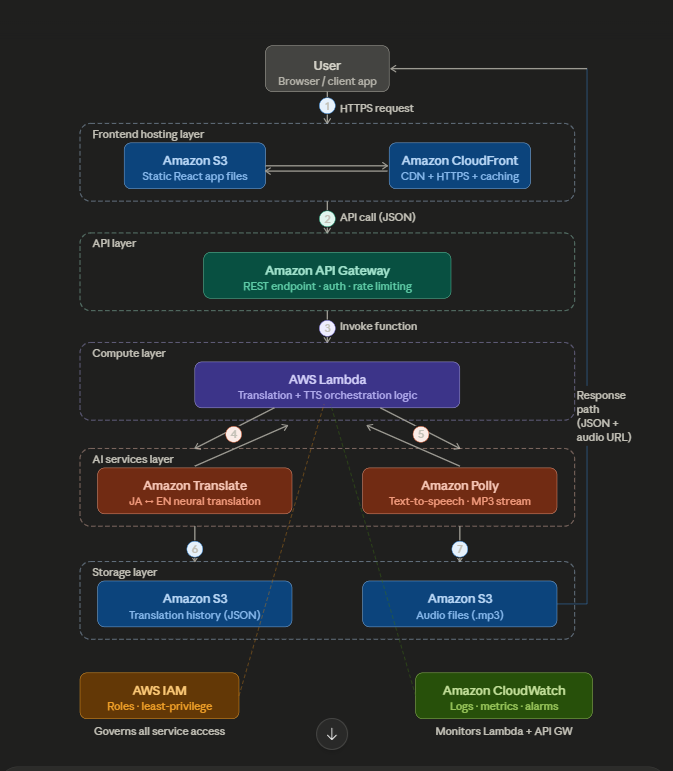

# AWS-Serverless-translator
### JP ↔ EN Business & IT Translator — Amazon Translate + Amazon Polly + Lambda + API Gateway

---

## What this project does

A serverless web application that translates text between Japanese and English, focused on business meeting vocabulary and IT/software development terms. The translated text is immediately converted to speech using Amazon Polly's neural voices. Every translation is logged to S3 for audit history.

---

## AWS services used

| Service | Role |
|---|---|
| Amazon S3 | Frontend hosting, audio file storage, translation history |
| Amazon CloudFront | CDN for frontend (optional, recommended for prod) |
| Amazon API Gateway | REST API — single POST /translate endpoint |
| AWS Lambda (Python 3.11) | Orchestration — calls Translate, Polly, writes to S3 |
| Amazon Translate | Neural machine translation JA ↔ EN |
| Amazon Polly | Text-to-speech, neural engine, MP3 output |
| AWS IAM | Least-privilege execution role for Lambda |
| Amazon CloudWatch | Automatic Lambda logs, metrics, error tracking |

---

## Architecture 

<p align="center">
  
</p>

<p align="center">
  <em>Serverless flow using API Gateway, Lambda, Translate, Polly, and S3</em>
</p>

---

## Prerequisites

```bash
# 1. Install AWS CLI v2
# https://docs.aws.amazon.com/cli/latest/userguide/getting-started-install.html

# 2. Configure credentials
aws configure
# Enter: Access Key ID, Secret Access Key, Region (e.g. ap-south-1), output format (json)

# 3. Verify
aws sts get-caller-identity
```

---

## Deployment (full steps)

```bash
# Clone / copy the project folder
cd jp-translator/deployment-scripts

# Make script executable
chmod +x deploy.sh

# Deploy everything
./deploy.sh
```

The script will:
1. Create 3 S3 buckets (history, audio, frontend)
2. Create an IAM role + least-privilege policy
3. Zip and deploy the Lambda function
4. Create API Gateway REST API with POST /translate
5. Set Lambda invoke permission for API Gateway
6. Deploy API to "prod" stage
7. Patch the frontend HTML with the real API URL
8. Upload frontend to S3 with static website hosting enabled

At the end it prints your live **Frontend URL** and **API URL**.

---

## Manual test (curl)

```bash
# Japanese → English
curl -X POST "https://YOUR_API_ID.execute-api.YOUR_REGION.amazonaws.com/prod/translate" \
  -H "Content-Type: application/json" \
  -d '{"text":"会議を始めます", "direction":"ja-en"}'

# English → Japanese
curl -X POST "https://YOUR_API_ID.execute-api.YOUR_REGION.amazonaws.com/prod/translate" \
  -H "Content-Type: application/json" \
  -d '{"text":"The sprint review is on Friday", "direction":"en-ja"}'
```

Expected response:
```json
{
  "requestId": "abc123...",
  "sourceText": "会議を始めます",
  "translatedText": "Let's start the meeting.",
  "audioUrl": "https://jp-translator-audio-XXXX.s3.amazonaws.com/audio/2025-01-01/abc123.mp3?...",
  "direction": "ja-en",
  "timestamp": "2025-01-01T10:00:00Z"
}
```

---

## Lambda environment variables

| Variable | Default | Description |
|---|---|---|
| `HISTORY_BUCKET` | jp-translator-history-{accountId} | S3 bucket for JSON translation logs |
| `AUDIO_BUCKET` | jp-translator-audio-{accountId} | S3 bucket for MP3 audio files |
| `AUDIO_URL_TTL` | 3600 | Pre-signed URL expiry in seconds |

---

## API reference

### POST /translate

**Request body:**
```json
{
  "text": "string (required) — text to translate",
  "direction": "ja-en | en-ja (required)"
}
```

**Response 200:**
```json
{
  "requestId":      "uuid",
  "sourceText":     "original input text",
  "translatedText": "translated output text",
  "audioUrl":       "pre-signed S3 URL (expires in AUDIO_URL_TTL seconds)",
  "direction":      "ja-en or en-ja",
  "timestamp":      "ISO 8601 UTC"
}
```

**Response 400:** Invalid input (missing text, wrong direction)  
**Response 502:** Upstream AWS service error

---

## Polly voices used

| Direction | Voice | Engine |
|---|---|---|
| Japanese → English | Joanna (US English, female) | Neural |
| English → Japanese | Takumi (Japanese, male) | Neural |

To change voices, edit `DIRECTION_MAP` in `lambda_function.py`.  
Full voice list: `aws polly describe-voices --region YOUR_REGION`

---

## Destroying all resources

```bash
./deploy.sh --destroy
```

This deletes: API Gateway, Lambda function, IAM role + policy, all 3 S3 buckets and their contents.

---

## Cost estimate (AWS Free Tier)

| Service | Free Tier | Typical usage |
|---|---|---|
| Lambda | 1M requests/month | Effectively free for demos |
| Amazon Translate | 2M chars/month (first 12 months) | Free for testing |
| Amazon Polly | 5M chars/month (first 12 months) | Free for testing |
| API Gateway | 1M calls/month (first 12 months) | Free for testing |
| S3 | 5 GB storage | < $0.01 |
